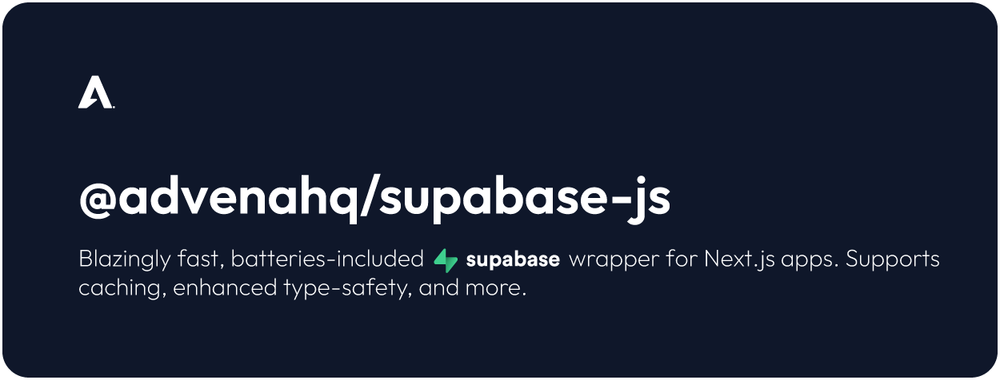

This package provides a high-performance, reusable, type-safe [Supabase](https://supabase.com/) client wrapper for TypeScript-based Next.js projects in both server and browser contexts (SSR/SSG and client). The package is designed to be secure, efficient, and easy to use, and provides a simple way to interact with your Supabase project.

## 👏 Features
- **Type-Safe**: Written in TypeScript with a focus on strong types. Provides a developer-friendly interface for working with the Supabase client safely.
- **Server-side Cache Support**: Supports a number of cache providers, including [**⚡supacache**](https://github.com/AdvenaHQ/supacache), [Upstash Redis](https://upstash.com/docs/redis/sdks/ts/overview), and custom redis servers, to dramatically improve performance for expensive and common queries. The extended client provides a `.cache()` method for granular, per-query cache control.
- **Full Supabase Client Support**: Maintains feature parity with the [supabase-js](https://www.npmjs.com/package/@supabase/supabase-js) client, with full support for vanilla all methods and properties, such as Realtime, REST API, Storage, Auth, etc.
- **Row Level Security (RLS) Support**: Both native and custom Row Level Security (RLS) patterns are supported. Pass custom JWTs at initialisation for use in the Authorization header, or use the built-in roles.
- **Service Role Support**: Painlessly create Supabase clients with your service_role for server-side operations that require elevated permissions.
- **Security-First Design**: Developed with security-first principles. Automatically identifies risky behaviour and corrects, scrubs sensitive configurations from the browser client at initialisation, etc.

## 📦 Installation [](https://www.npmjs.com/package/@advenahq/supabase-js)
To install the package, run the following command:
```bash
npm i @advenahq/supabase-js
```

## 🚗 Usage
Once you've installed the library, you're pretty much ready to go. Import the `useSupabase` hook from the package and use it to create a new Supabase server client. All of the [standard Supabase client methods and properties](https://supabase.com/docs/reference/javascript/select) are available on the client and the usage is exactly the same, except for the configuration options that can be passed to the `useSupabase` hook.

You can configure the client either inline (on-the-fly) or using a **[shared configuration file](#shared-configuration) (recommended)**. Here's how to get started using an inline configuration:

```tsx
import { useSupabase } from "@advenahq/supabase-js";

export default async function Page() {
    // Create a new Supabase client, configuring it inline
    const supabase = await useSupabase({
        role: "anon", // Use the anonymous role
        supabaseUrl: process.env.UPV_SECRETS_SUPABASE_URL as string, // Your project's Supabase URL
        auth: {
            keys: {
                secret: process.env.UPV_SECRETS_SUPABASE_SERVICEROLE_KEY as string, // Your project's service_role (secret) key
                publishable: process.env.UPV_SECRETS_SUPABASE_ANON_KEY as string, // Your project's anon (publishable) key
            },
        },
    });

    // Then, just use the client as you normally would

    const { data, error } = await supabase
        .from("users")
        .select("*")
        .eq("id", 1)
        .limit(1)
        .single();

    // ...
}
```

---

### 💾 Caching 

The client supports a number of cache providers, including [**⚡supacache**](https://github.com/AdvenaHQ/supacache), [Upstash Redis](https://upstash.com/docs/redis/sdks/ts/overview), and custom redis servers.

Caching can be applied either globally (this is the default behaviour) or [per-query using the `.cache()` method](#the-cache-method). The global cache configuration is set at initialisation and applies to all queries made with the client. The `.cache()` method allows you to cache the response of a query for a specified amount of time.

> [!NOTE]
> It's important to note that caching is per-query, so if you're using queries with highly dynamic filters or constructions, you may not see the full benefits of caching. Caching is most effective when your queries are fairly consistent, as is typically the case with database operations.

Configuring a cache provider is simple and can be done using the `cache` configuration option. Supported provider configurations are provided [in the advanced configuration section](#advanced-configuration).

Configuring the client with a cache provider will automatically cache all responses from the Supabase API for the specified amount of time.

---

### The `.cache()` Method

If you have configured the client with [⚡supacache](https://github.com/AdvenaHQ/supacache), you can use the `.cache()` method to cache the response of a query for a specified amount of time. This is useful for expensive queries that are common and can be cached for a period of time to improve performance.

It is important to note that **caching is only supported on `SELECT` queries**. Here's an example of how to use the `.cache()` method:

```tsx
import { useSupabase } from "@advenahq/supabase-js";

// ...

// Use the Supabase client exported by the shared configuration
const supabase = await useSupabase();

// Fetch data from the users table
const { data, error } = await supabase
    .from("users")
    .cache(86400) // Cache the response for 24 hours (86400 seconds = 24 hours)
    .select("*")
    .eq("id", 1);

// ...
```

The `.cache()` method must be called immediately after `.from()` and before any other methods. It accepts a TTL in seconds as it's only argument. This is the amount of time that the response of **this query** will be cached for. 

---

### Shared Configuration

Configuring your client using a shared configuration file is recommended. This allows you to easily reuse the configuration across your application and ensures that your client is always initialised with the same settings. 

Here's an example of a shared configuration file, initialised with [supacache](https://github.com/AdvenaHQ/supacache) for caching, and database schema types generated using the [Supabase CLI](https://supabase.com/docs/reference/javascript/typescript-support#generating-typescript-types):

```typescript
// lib/supabase.ts

import { useSupabase as _useSupabase } from "@advenahq/supabase-js";
import type { UseSupabaseOptions } from "@advenahq/supabase-js/types";
import type { Database } from "../path/to/database.types"; // https://supabase.com/docs/reference/javascript/typescript-support

export const useSupabase = async (
    role: "service_role" | "anon" = "service_role", // The role to use for the Supabase client, either "service_role" or "anon". Defaults to "service_role".
    extendConfig?: Partial<UseSupabaseOptions> | undefined, // Optional configuration to extend the default Supabase options.
) =>
    await _useSupabase<Database>({
        cache: {
            provider: "supacache", // Use supacache for caching
            supacache: {
                url: "https://supacache.mycloudflareworker.workers.dev", // Your supacache Worker URL
                serviceKey:
                    process.env.UPV_SECRETS_SUPABASE_URL as string, // Your supacache service key
            },
        },
        role: "anon", // Use the anonymous role by default (this can be swapped out per-query by passing the "service_role" in the `role` parameter)
        supabaseUrl: process.env.UPV_SECRETS_SUPABASE_URL as string, // Your project's Supabase URL
        auth: {
            keys: {
                secret: process.env.UPV_SECRETS_SUPABASE_SERVICEROLE_KEY, // Your project's service_role (secret) key
                publishable: process.env.UPV_SECRETS_SUPABASE_ANON_KEY, // Your project's anon (publishable) key
            },
        },
    });
```

You can then use the shared configuration file to create a new Supabase client in your application as you normally would:

```tsx
// app/page.ts

import { useSupabase } from "../lib/useSupabase";

export default async function Page() {
    // Use the Supabase client exported by the shared configuration
    const supabase = await useSupabase();

    // Fetch data from the users table
    const { data, error } = await supabase
        .from("users")
        .select("*")
        .eq("id", 1)
        .limit(1)
        .single();

    ...
}
```

or, *even better*, using the database types and custom cache ttl:

```tsx
// app/page.ts

import { useSupabase } from "../lib/useSupabase";
import type { Tables } from "../path/to/database.types"; // https://supabase.com/docs/reference/javascript/typescript-support

export default async function Page() {
    // Use the Supabase client exported by the shared configuration
    const supabase = await useSupabase();

    // Fetch data from the users table
    const { data, error } = await supabase
        .from("users")
        .cache(86400) // Cache the response for 24 hours (86400 seconds = 24 hours)
        .select("*")
        .eq("id", 1)
        .limit(1)
        .single<Tables<"users">>(); // Use the database types to type the response

    // ...
}
```

---

### Usage in the Browser (Client)

The client can also be used in the browser. This is useful for client-side operations that require authentication. 

> [!IMPORTANT]
> In order to use the client in the browser, you must import the `useSupabase` hook from the browser entrypoint: `import { useSupabase } from '@advenahq/supabase-js/browser';`

Here's an example of how to use the client in the browser:

```tsx
// components/MyComponent.tsx
"use client";

import { useSupabase } from '@advenahq/supabase-js/browser'; // Import the `useSupabase` hook from the browser entrypoint

function MyComponent() {
    // Create a new Supabase browser client
    const supabase = useSupabase({
        supabaseUrl: process.env.UPV_SECRETS_SUPABASE_URL as string, // Your project's Supabase URL
        auth: {
            keys: {
                publishable: process.env.UPV_SECRETS_SUPABASE_ANON_KEY as string, // Your project's anon (publishable) key
            },
        },
    });

    // Use the client in the browser as you normally would
    supabase
        .channel('room1')
        .on('postgres_changes', { event: '*', schema: 'public', table: 'countries' }, payload => {
            console.log('Change received!', payload)
        })
        .subscribe();

    // ...
}
```

---

### Environment Variables

You can optionally use environment variables to configure the client. This is useful for keeping sensitive information out of your codebase. These are the environment variables that the client is configured to use by default:

```bash
# Retrieve these settings from your Supabase project's settings page (https://supabase.com/dashboard/project/_vnwgrcyvvigzihuvcutp_/settings/api)

# The URL of the Supabase API
UPV_SECRETS_SUPABASE_URL=https://<your-supabase-url>.supabase.co

# Your Supabase project's secret/service_role JWT (API key)
UPV_SECRETS_SUPABASE_SERVICEROLE_KEY=<your-supabase-service-role-key>

# Your Supabase project's publishable/anon JWT (API key)
UPV_SECRETS_SUPABASE_ANON_KEY=<your-supabase-anon-key>

# Your Supabase project's JWT secret (for signing JWTs)
UPV_SECRETS_SUPABASE_JWT_SECRET=<your-supabase-jwt-secret>
```

If environment variables are set, the package will automatically use them to configure the client. This means that you can simply:

```tsx
import { useSupabase } from "@advenahq/supabase-js";

export default async function Page() {
    // Create a new Supabase client, relying on environment variables for configuration
    const supabase = await useSupabase();

    // ...
}
```

## 💼 Using Roles

You can optionally create a Supabase client with the Supabase service role. This is useful for server-side operations that require elevated permissions but should be done so with great caution as **the service role has full access to your database and bypasses all Row Level Security (RLS) policies**. By default, the client is created with the anonymous (anon) role.

```tsx
import { useSupabase } from "@advenahq/supabase-js";

// ...

const supabase = await useSupabase({
    // your other configuration options ...

    role: "service_role", // Use the service role

    // your other configuration options ...
});

// ...
```

## ⚙️ Advanced Configuration

The following configuration options are available for the `useSupabase` hook:

```typescript
{
    /**
     * Configures the provider for caching responses from the Supabase API.
     */
    cache?: {
        /**
         * The provider to use for caching responses from the Supabase API.
         * 
         * Possible values:
         * - `"supacache"`: Use a Supacache middleware service for intermediary caching.
         * - `"upstash-redis"`: Use Upstash Redis for intermediary caching.
         * - `"redis"`: Use Node Redis for intermediary caching.
         *
         * @default undefined (no intermediary caching)
         */
        provider: "supacache" | "redis" | "upstash-redis" | undefined;

        /**
         * Configuration options for the Supacache (middleware) cache provider.
         *
         * @see https://github.com/AdvenaHQ/supacache
         */
        supacache?: {
            /**
             * The URL of the Supacache middleware service.
             */
            url: string;

            /**
             * The cache service (auth) key for the Supacache middleware service. This is the
             * `SUPACACHE_SERVICE_KEY` secret configured on the worker.
             *
             * @see https://github.com/AdvenaHQ/supacache?tab=readme-ov-file#middleware-worker-setup
             */
            serviceKey?: string | undefined;
        };

        /**
         * Configuration options for the Upstash Redis cache provider.
         */
        upstash?: {
            /**
             * The URL of the Upstash Redis instance.
             */
            url: RedisConfigNodejs["url"];

            /**
             * The token for the Upstash Redis instance.
             */
            token: RedisConfigNodejs["token"];

            /**
             * The configuration options for the Upstash Redis client.
             */
            config?: RedisConfigNodejs;

            /**
             * The behavior options for the Upstash Redis cache provider.
             */
            behaviour?: {
                /**
                 * The time, in seconds, after which cached responses should expire and be dropped from the cache.
                 *
                 * @default 3600 (1 hour)
                 */
                expireSetAfter?: number | undefined;
            };
        } & RedisConfigNodejs;

        /**
         * Configuration options for the redis (ioredis) cache provider.
         */
        ioredis?: {
            /**
             * The Connection URL of the Redis instance.
             */
            url: string;
        };
    };

    /**
     * Configuration options for the Supabase client, passed to the Supabase client constructor.
     *
     * @link https://supabase.com/docs/reference/javascript/initializing
     *
     * @default undefined (use the default options):
     *  - `config.db.schema` = "public"
     */
    config?: SupabaseClientServerOptionsType | undefined;

    /**
     * The database role to use when interacting with the Supabase API. This option has no effect if `auth.useToken` is set (as the JWT supplied to useToken will contain a "role" key).
     *
     * This option is useful when you need to use a specific role for server-side operations. Using "service_role" will cause the client to use the service role key.
     *
     * Possible values:
     * - `"anon"`: Use the anonymous role.
     * - `"service_role"`: Use the service role.
     *
     * @default "anon" (anonymous role)
     */
    role?: "anon" | "service_role" | undefined; // "authenticated"

    /**
     * The URL of the Supabase API.
     *
     * @default process.env.UPV_SECRETS_SUPABASE_URL
     */
    supabaseUrl: string;

    /**
     * Configures the authentication options for the Supabase client.
     */
    auth?: {
        /**
         * The JSON Web Token (JWT) to use for Row Level Security, used to construct the Authorization header. If configured, this option will override `role`, `keys.secret`, and `keys.publishable`.
         *
         * @remarks This is useful when you're using Supabase Auth and need custom claims for Row Level Security.
         */
        useToken?: string | undefined;

        /**
         * The secret key to use for signing JWTs.
         *
         * @remarks This is used for signing JWTs for use with Supabase Auth.
         * @link https://supabase.com/dashboard/project/_/settings/api
         */
        jwtSecret?: string | undefined;

        /**
         * Configures the keys to use for authenticating requests to the Supabase API. This option has no effect if `useToken` is set.
         */
        keys?: {
            /**
             * Your Supabase installation's secret/service_role JWT (API key). This option has no effect if `auth.useToken` is set.
             *
             * @remarks This is used for server-side operations that require elevated permissions.
             * @link https://supabase.com/dashboard/project/_/settings/api
             *
             * @default process.env.UPV_SECRETS_SUPABASE_SERVICEROLE_KEY
             */
            secret?: string | undefined;

            /**
             * Your Supabase installation's publishable/anon JWT (API key).
             *
             * @link https://supabase.com/dashboard/project/_/settings/api
             *
             * @default process.env.UPV_SECRETS_SUPABASE_ANON_KEY
             */
            publishable?: string | undefined;
        };
    };
}
```

## 🧸 Contributing
Contributions are welcome! Please open an issue or submit a pull request for any improvements or bug fixes.

## ⚖️ License
This project is licensed under the GNU GPLv3 License. See the LICENSE file for details.


