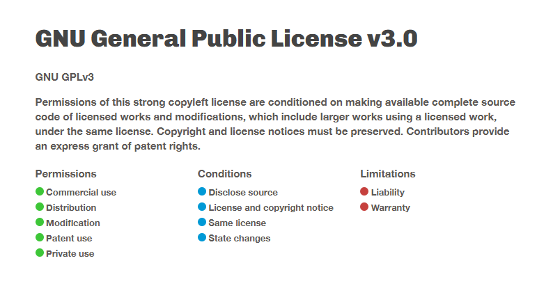

# ⚡ @advenahq/supabase-js [](https://www.npmjs.com/package/@advenahq/supabase-js)

This package provides a high-performance, type-safe, reusable wrapper for utilising the Supabase client in Next.js projects in both server and browser contexts (SSR/SSG and client). The package is designed to be secure, efficient, and easy to use, and provides a simple way to interact with the Supabase client in a Next.js project.

## 👏 Features
- **Type-Safe**: Written in TypeScript and provides custom, type-safe extended interfaces for working with the Supabase client safely.
- **Server-side Cache Support**: The package supports a number of cache providers, including [supacache](https://github.com/AdvenaHQ/supacache), [Upstash Redis](https://upstash.com/docs/redis/sdks/ts/overview), and vanilla redis servers (via [ioredis](https://github.com/redis/ioredis)), to dramatically improve performance for expensive and common queries.
- **Full Supabase Client Support**: Provides full support for the Supabase client, including all methods and properties, such as Realtime, REST API, Storage, Auth, etc.
- **Row Level Security (RLS) Support**: Both native and custom Row Level Security (RLS) patterns are supported by allowing you to pass custom JWTs at initialisation for use in the Authorization header (or utilise in-built roles).
- **Service Role Support**: Painlessly create Supabase clients with your service role for server-side operations that require elevated permissions.
- **Security-First Design**: The package is designed with security in mind and provides a safe and secure way to interact with your Supabase project. It automatically identifies risky behaviour and accounts for it, and scrubs sensitive configurations from the browser client at initialisation.

## 📦 Installation
To install the package, run the following command:
```bash
pnpm add @advenahq/supabase-js
```

## ⚙️ Configuring the Package
The package can be initialised and configured either inline (on-the-fly) or using a **shared configuration file (recommended)**.

For ease of use, it is recommended to set the following environment variables in your project's root:

```bash
# Retrieve these settings from your Supabase project's settings page (https://supabase.com/dashboard/project/_vnwgrcyvvigzihuvcutp_/settings/api)

# The URL of the Supabase API
UPV_SECRETS_SUPABASE_URL=https://<your-supabase-url>.supabase.co

# Your Supabase project's secret/service_role JWT (API key)
UPV_SECRETS_SUPABASE_SERVICEROLE_KEY=<your-supabase-service-role-key>

# Your Supabase project's publishable/anon JWT (API key)
UPV_SECRETS_SUPABASE_ANON_KEY=<your-supabase-anon-key>

# Your Supabase project's JWT secret (for signing JWTs)
UPV_SECRETS_SUPABASE_JWT_SECRET=<your-supabase-jwt-secret>
```

You can configure the package (and client) by passing configuration options to the `useSupabase` hook. The following configuration options are available:

```typescript
{
    /**
     * Configures the provider for caching responses from the Supabase API.
     */
    cache?: {
        /**
         * The provider to use for caching responses from the Supabase API.
         * 
         * Possible values:
         * - `"supacache"`: Use a Supacache middleware service for intermediary caching.
         * - `"upstash-redis"`: Use Upstash Redis for intermediary caching.
         * - `"redis"`: Use Node Redis for intermediary caching.
         *
         * @default undefined (no intermediary caching)
         */
        provider: "supacache" | "redis" | "upstash-redis" | undefined;

        /**
         * Configuration options for the Supacache (middleware) cache provider.
         *
         * @see https://github.com/AdvenaHQ/supacache
         */
        supacache?: {
            /**
             * The URL of the Supacache middleware service.
             */
            url: string;

            /**
             * The cache service (auth) key for the Supacache middleware service. This is the
             * `SUPACACHE_SERVICE_KEY` secret configured on the worker.
             *
             * @see https://github.com/AdvenaHQ/supacache?tab=readme-ov-file#middleware-worker-setup
             */
            serviceKey?: string | undefined;
        };

        /**
         * Configuration options for the Upstash Redis cache provider.
         */
        upstash?: {
            /**
             * The URL of the Upstash Redis instance.
             */
            url: RedisConfigNodejs["url"];

            /**
             * The token for the Upstash Redis instance.
             */
            token: RedisConfigNodejs["token"];

            /**
             * The configuration options for the Upstash Redis client.
             */
            config?: RedisConfigNodejs;

            /**
             * The behavior options for the Upstash Redis cache provider.
             */
            behaviour?: {
                /**
                 * The time, in seconds, after which cached responses should expire and be dropped from the cache.
                 *
                 * @default 3600 (1 hour)
                 */
                expireSetAfter?: number | undefined;
            };
        } & RedisConfigNodejs;

        /**
         * Configuration options for the redis (ioredis) cache provider.
         */
        ioredis?: {
            /**
             * The Connection URL of the Redis instance.
             */
            url: string;
        };
    };

    /**
     * Configuration options for the Supabase client, passed to the Supabase client constructor.
     *
     * @link https://supabase.com/docs/reference/javascript/initializing
     *
     * @default undefined (use the default options):
     *  - `config.db.schema` = "public"
     */
    config?: SupabaseClientServerOptionsType | undefined;

    /**
     * The database role to use when interacting with the Supabase API. This option has no effect if `auth.useToken` is set (as the JWT supplied to useToken will contain a "role" key).
     *
     * This option is useful when you need to use a specific role for server-side operations. Using "service_role" will cause the client to use the service role key.
     *
     * Possible values:
     * - `"anon"`: Use the anonymous role.
     * - `"service_role"`: Use the service role.
     *
     * @default "anon" (anonymous role)
     */
    role?: "anon" | "service_role" | undefined; // "authenticated"

    /**
     * The URL of the Supabase API.
     *
     * @default process.env.UPV_SECRETS_SUPABASE_URL
     */
    supabaseUrl: string;

    /**
     * Configures the authentication options for the Supabase client.
     */
    auth?: {
        /**
         * The JSON Web Token (JWT) to use for Row Level Security, used to construct the Authorization header. If configured, this option will override `role`, `keys.secret`, and `keys.publishable`.
         *
         * @remarks This is useful when you're using Supabase Auth and need custom claims for Row Level Security.
         */
        useToken?: string | undefined;

        /**
         * The secret key to use for signing JWTs.
         *
         * @remarks This is used for signing JWTs for use with Supabase Auth.
         * @link https://supabase.com/dashboard/project/_/settings/api
         */
        jwtSecret?: string | undefined;

        /**
         * Configures the keys to use for authenticating requests to the Supabase API. This option has no effect if `useToken` is set.
         */
        keys?: {
            /**
             * Your Supabase installation's secret/service_role JWT (API key). This option has no effect if `auth.useToken` is set.
             *
             * @remarks This is used for server-side operations that require elevated permissions.
             * @link https://supabase.com/dashboard/project/_/settings/api
             *
             * @default process.env.UPV_SECRETS_SUPABASE_SERVICEROLE_KEY
             */
            secret?: string | undefined;

            /**
             * Your Supabase installation's publishable/anon JWT (API key).
             *
             * @link https://supabase.com/dashboard/project/_/settings/api
             *
             * @default process.env.UPV_SECRETS_SUPABASE_ANON_KEY
             */
            publishable?: string | undefined;
        };
    };
}
```

## Configuring the client

### Shared Configuration

A shared configuration file might look like this:

```typescript
// lib/supabase.ts

import { useSupabase as _useSupabase } from "@advenahq/supabase-js";
import type { UseSupabaseOptions } from "@advenahq/supabase-js/types";

import type { Database } from "../path/to/database.types"; // https://supabase.com/docs/reference/javascript/typescript-support

/**
 * Asynchronously initializes and returns a Supabase client with the specified role and configuration.
 *
 * @param role - The role to use for the Supabase client, either "service_role" or "anon". Defaults to "service_role".
 * @param extendConfig - Optional configuration to extend the default Supabase options.
 * 
 * @returns A promise that resolves to the initialized Supabase client.
 */
export const useSupabase = async (
    role: "service_role" | "anon" = "service_role",
    extendConfig?: Partial<UseSupabaseOptions> | undefined,
) =>
    await _useSupabase<Database>({
        cache: {
            provider: "supacache",
            supacache: {
                url: "https://supacache.mycloudflareworker.workers.dev",
                serviceKey:
                    "your-service-key",
            },
        },
        role: "anon",
        supabaseUrl: process.env.UPV_SECRETS_SUPABASE_URL as string, // Your project's Supabase URL
        auth: {
            keys: {
                secret: process.env.UPV_SECRETS_SUPABASE_SERVICEROLE_KEY, // Your project's service_role (secret) key
                publishable: process.env.UPV_SECRETS_SUPABASE_ANON_KEY, // Your project's anon (publishable) key
            },
        },
    });
```

you would then use the client as you normally would in your application:

```tsx
// app/page.ts

import { useSupabase } from "@/lib/useSupabase";

export default async function Page() {
    // Use the Supabase client exported by the shared configuration
    const supabase = await useSupabase();

    // Fetch data from the users table
    const { data, error } = await supabase
        .from("users")
        .select("*")
        .eq("id", 1)
        .limit(1)
        .single();

    const { data, error } = await supabase
        .from<Database.User>("users")
        .select("*")
        .eq("id", 1)
        .limit(1)
        .single({ cacheTTL: 60 * 60 * 24 }); // Cache the response for 24 hours

    ...
}
```

or, even better, using the database types and custom cache ttl:

```tsx
// app/page.ts

import { useSupabase } from "@/lib/useSupabase";

import type { Tables } from "../path/to/database.types"; // https://supabase.com/docs/reference/javascript/typescript-support

export default async function Page() {
    // Use the Supabase client exported by the shared configuration
    const supabase = await useSupabase();

    // Fetch data from the users table
    const { data, error } = await supabase
        .from("users")
        .cache(86400) // Cache the response for 24 hours (86400 seconds = 24 hours)
        .select("*")
        .eq("id", 1)
        .limit(1)
        .single<Tables<"users">>();

    ...
}
```

---

### Inline configuration 
Alternatively, as mentioned, you can initialise and configure the package inline:

```tsx
import { useSupabase } from "@advenahq/supabase-js";

export default async function Page() {
    // Create a new Supabase client, configuring it inline
    const supabase = await useSupabase({
        role: "anon",
        supabaseUrl: process.env.UPV_SECRETS_SUPABASE_URL as string,
        auth: {
            keys: {
                secret: process.env.UPV_SECRETS_SUPABASE_SERVICEROLE_KEY,
                publishable: process.env.UPV_SECRETS_SUPABASE_ANON_KEY,
            },
        },
    });

    ...
}
```

If environment variables are set, the package will automatically use them to configure the client. If not, you can pass the configuration options directly to the `useSupabase` hook. This means that you can simply:

```tsx
import { useSupabase } from "@advenahq/supabase-js";

export default async function Page() {
    // Create a new Supabase client, relying on environment variables for configuration
    const supabase = await useSupabase();

    ...
}
```

## 🚗 Basic Usage
Use the `useSupabase` hook to create a new Supabase client. The client can be used to interact with the Supabase API, including querying the database, using Realtime, and interacting with the Storage and Auth services.

You then use the created client as you would the standard Supabase client from the `@supabase/supabase-js` package. Comprehensive documentation is available on the [Supabase website](https://supabase.com/docs/reference/javascript/select).

## 💼 Using Roles
You can optionally create a Supabase client with the Supabase service role. This is useful for server-side operations that require elevated permissions but should be done so with great caution as **the service role has full access to your database and bypasses all Row Level Security (RLS) policies**. By default, the client is created with the anonymous (anon) role.

```tsx
// lib/supabase.ts

import { useSupabase as _useSupabase } from "@advenahq/supabase-js";

export const useSupabase = async () =>
    await _useSupabase({
        role: "service_role", // Use the service role
        ...
    });
```

## 👋 Client (Browser) Usage
The client can also be used in the browser. This is useful for client-side operations that require authentication.
```tsx
// components/MyComponent.tsx
"use client";

import { useSupabase } from '@advenahq/supabase-js/browser';

function MyComponent() {
    // Create a new Supabase browser client
    const supabase = useSupabase();

    // Use the client in the browser as you normally would
    supabase
        .channel('room1')
        .on('postgres_changes', { event: '*', schema: 'public', table: 'countries' }, payload => {
            console.log('Change received!', payload)
        })
        .subscribe();

    ...
}
```

## 🧸 Contributing
Contributions are welcome! Please open an issue or submit a pull request for any improvements or bug fixes.

## ⚖️ License
This project is licensed under the GNU GPLv3 License. See the LICENSE file for details.

